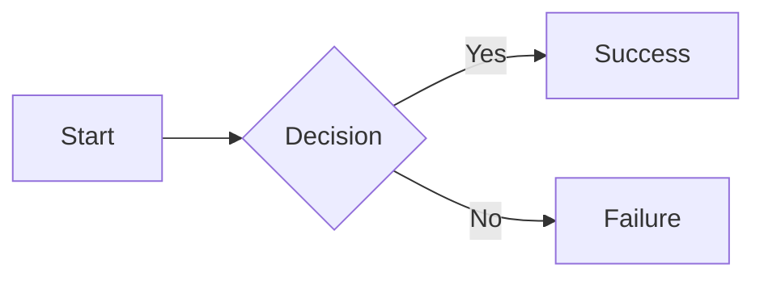
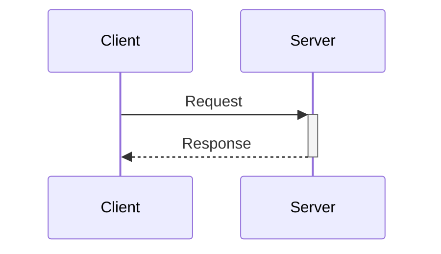
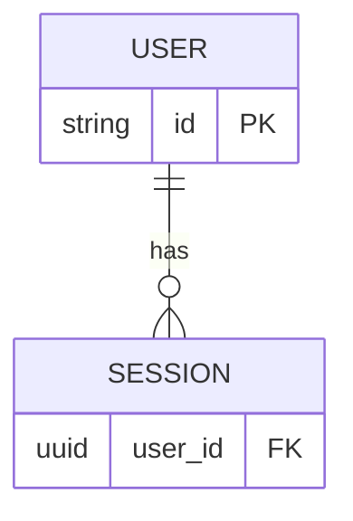
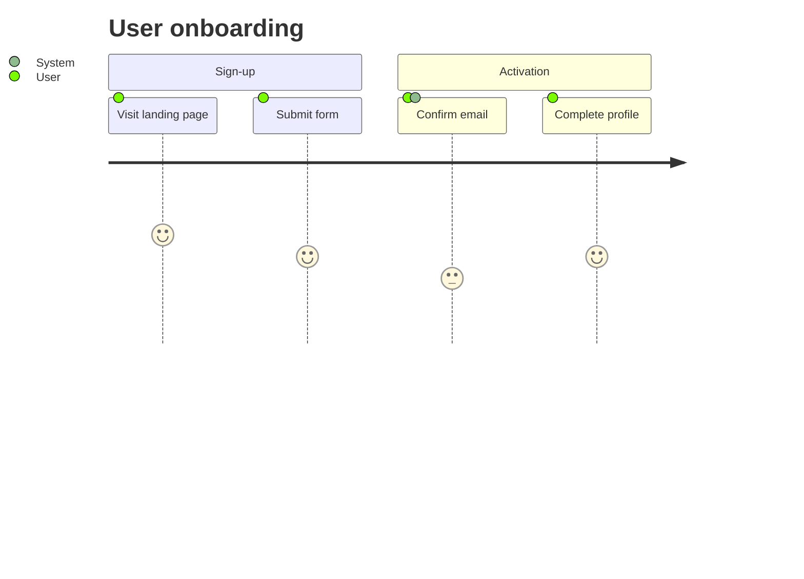

# mermaid.md

Quick reference for using Mermaid diagrams in `plan.md` files — what GitHub renders, when to use each type, skeletons, and gotchas.

---

## Diagram types GitHub renders

Use **stable types only** in committed docs. Beta/experimental types may lag behind GitHub's Mermaid version.

| Type | Keyword | Use when… |
|---|---|---|
| Flowchart | `flowchart` | Control flow, logic branches, pipeline steps |
| Sequence | `sequenceDiagram` | API calls, message passing, async interactions |
| ERD | `erDiagram` | Data models, schema relationships |
| User Journey | `journey` | Multi-step UX flows, user-facing process stages |
| State machine | `stateDiagram-v2` | FSM, lifecycle states |
| Class | `classDiagram` | OO design, interface hierarchies |
| Gantt | `gantt` | Milestone/sprint timelines |
| Pie | `pie` | Simple proportional breakdowns |

Beta types (`sankey-beta`, `xychart-beta`, `architecture-beta`, etc.) exist but GitHub rendering is not guaranteed — test in [Mermaid Live](https://mermaid.live/) first.

---

## Requirement → diagram type map

- Control / logic flow → `flowchart`
- API / message / async flow → `sequenceDiagram`
- Data model / schema → `erDiagram`
- UX / multi-step user flow → `journey`

---

## Skeletons

### flowchart

### sequenceDiagram

### erDiagram

### journey

---

## GitHub rendering gotchas

- **Non-ASCII / CJK labels** — must be wrapped in double quotes: `A["인증 흐름"]`; bare non-Latin text causes parse failures.
- **ERD relationship labels are mandatory** — omitting the label after `:` causes a parse error: `USER ||--o{ ORDER : "places"` not `USER ||--o{ ORDER`.
- **Semicolons in sequence messages** — escape as `#59;` to avoid parser confusion.
- **Hash (`#`) in messages** — escape as `#35;` (e.g. issue references).
- **Flowchart `subgraph` blocks** must close with `end`.
- **Hyphens in node IDs** — quote them: `A["my-node"]` not `A[my-node]`.
- **`actor` vs `participant`** in sequence diagrams — `actor` renders as stick figure, `participant` as box.
- **Beta types** (`*-beta`, `kanban`) may not render on GitHub even if valid Mermaid syntax; always validate in [mermaid.live](https://mermaid.live/) first.

---

## Source

Guidance derived from: <https://gist.githubusercontent.com/est-wiii/672237ab3f1cd471eb4eebe968d2c79c/raw/e8f15f306545feef12230b62b152f7df73a3e7a6/mermaid-guide.md>
